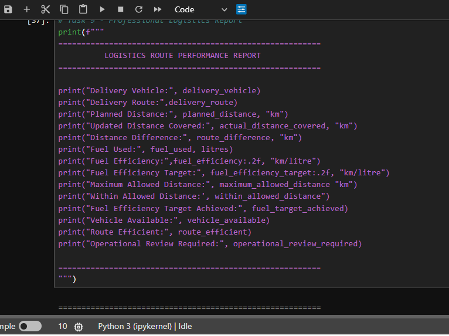
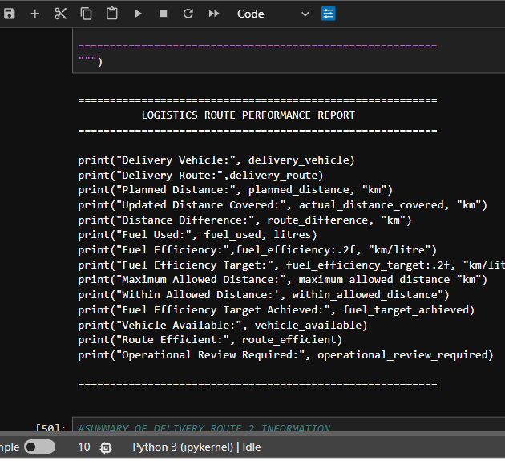

# Logistics Route Performance Analysis (Python Case Study)

##  Project Overview

This project analyzes the performance of delivery routes for a logistics company using basic Python programming concepts.

The program calculates:

- Route distance difference
- Fuel efficiency
- Updated distance after a road diversion
- Whether the vehicle stayed within the maximum allowed distance
- Whether the fuel efficiency target was achieved
- Whether the route was efficient
- Whether an operational review is required

This project was completed using only the concepts covered in Lessons 1–5.

---

##  Project Objectives

The program performs the following tasks:

- Create variables using appropriate data types.
- Perform arithmetic calculations.
- Update values using assignment operators.
- Compare values using comparison operators.
- Evaluate conditions using logical operators.
- Generate a professional logistics performance report.

---

##  Technologies Used

- Python 3
- Jupyter Notebook

---

##  Python Concepts Used

- Variables
- Data Types
- Arithmetic Operators
- Assignment Operators
- Comparison Operators
- Logical Operators
- f-Strings
- `print()` Statements

---

##  Project Structure

```
Logistics-Route-Performance/
│
├── logistics_route.py
├── README.md
└── screenshots/
```

## Screenshots

### Python Code Parameters


### Python Code



### Program Output


---

## How to Run

1. Install Python 3 and Jupyter Notebook (or Anaconda).
2. Clone or download this repository.
3. Open the `project` folder.
4. Launch Jupyter Notebook.
5. Open `Logistics Route Optimizer Casestudy.ipynb`.
6. Run all cells to view the results.

---


##  Learning Outcomes

This project helped me practice:

- Creating meaningful variables
- Performing calculations in Python
- Using Boolean logic
- Writing clean and readable code
- Formatting professional reports with f-strings

---

##  Author

Chimamaka Victor Daniel  Data Analyst | Junior Python Developer

---
